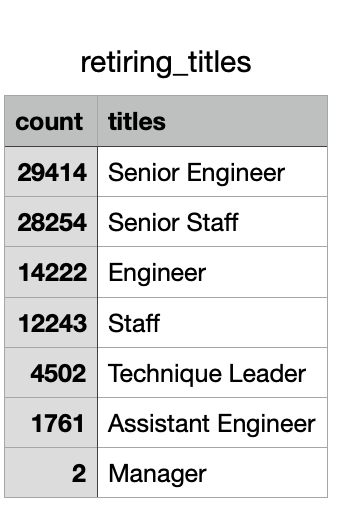
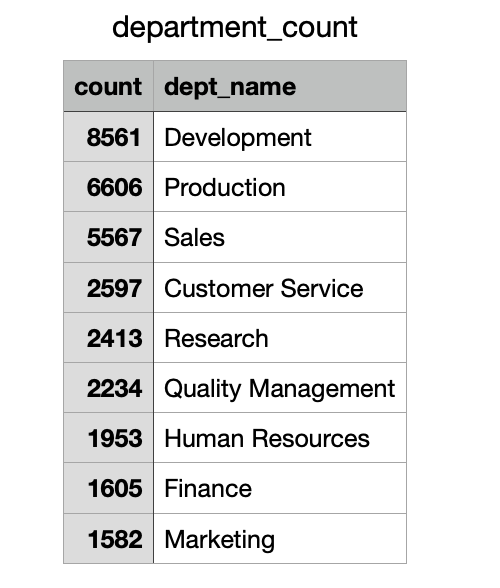
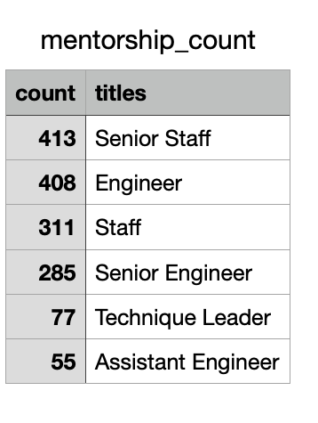

# Pewlett-Hackard-Analysis
# Overview
-----

The purpose of this analysis is to help Pewlett-Hackard prepare for the upcoming wave of employees that will be retiring.To do this we will be determining the number of employees that are eligible for retirement. We will also be looking at the number of employees that are eligible for a mentorship program.
# Results
------
 * This  anlaysis looked at two main components. One, all current employees at Pewlett-Hackard, that had birth dates between 1952 and 1955, to determine retirement eligibility.We aslo looked a their current titles with the company for this analysis. 
  
 * Upon analysis there are seven types of positions that have retirement eligible employees. Of those seven the Senior Engineers will be the most impacted, there are 29,414 employees with this title that are of retirement age across all departments. Followed by the Senior Staff with, 28,254 people eligible. There is a significant decrease in retirement eligible employees among the staff, engineers, technique leaders,assistant engineers and managers. There are only two people that are management up for retirement.

* After analyzing the amount of employees eligible for retirement , we wanted to look at those that are eligible to participate in  a mentorship program. The requirements for eligibility are being a current employee and having a birth date between January 1,1965 and december 31,1965.
*  Once these were taken into consideration there are 1549 people that meet this criteria with all different titles. The two managers up for retirement were not eligible for the program.

# Summary
------------
 The numbers show that there are 90,398 people that are approaching possible retirement according to our count by position titles in the table shown above. We can also look how the different departments may be affected by the following table.
 
 

With this large number of roles to fill there are only 1,549 that are eligible to mentor. 

  If we refer to the table below, It shows the count of those eligible for mentorship by current title in the company. The company is losing   the largest amount in the Senior Egineers and yet that title has some of the lowest numbers that are eligible to mentor.
  

   With these large numbers it looks like it may be a struggle to properly mentor and fill all these positions.